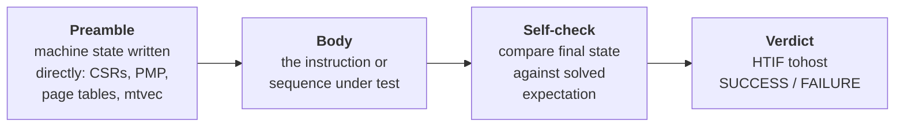
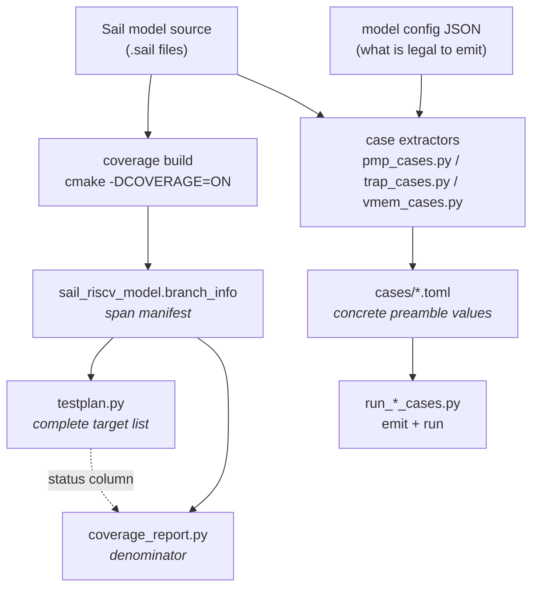
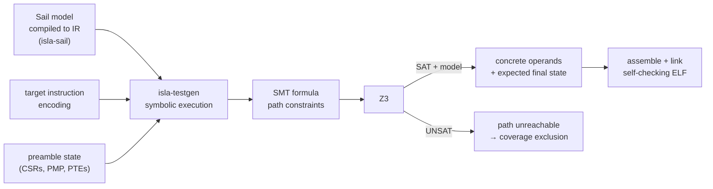
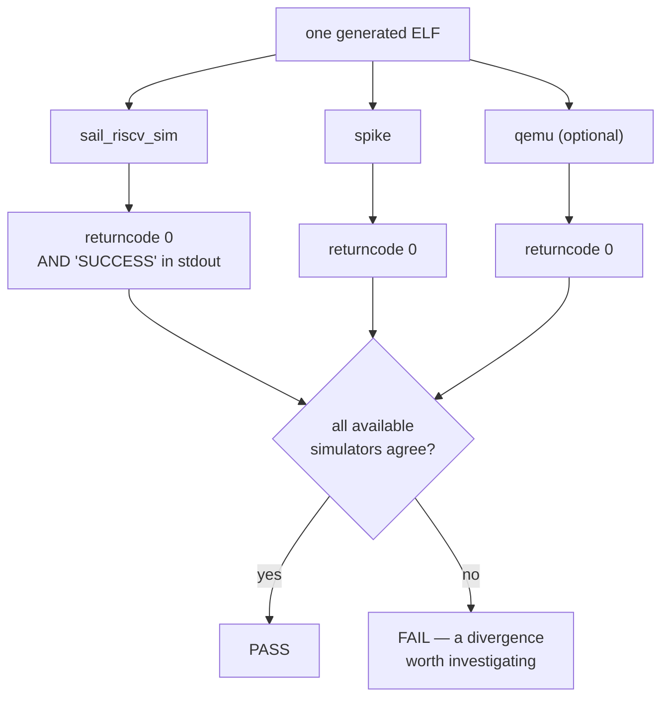
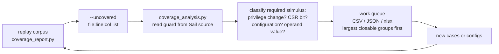
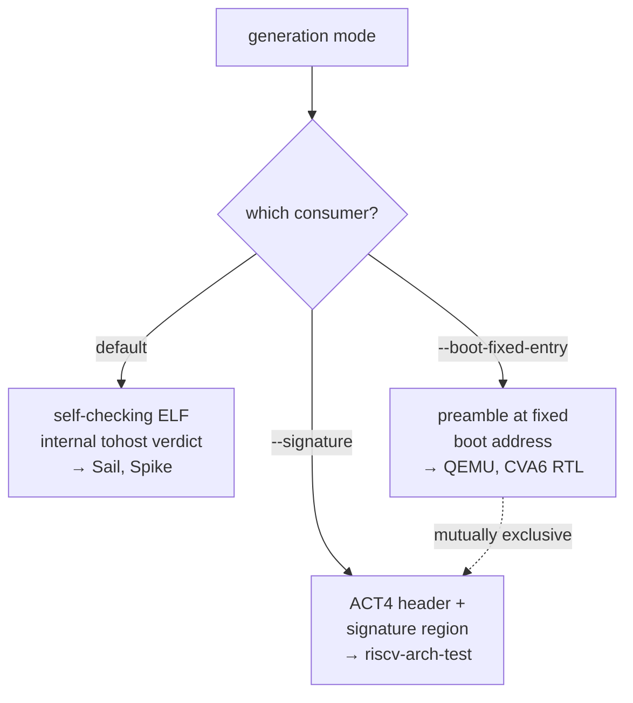

# riscv-test-generation

Generate RISC-V tests from the Sail Golden Model, run them on independent
simulators, and measure coverage against the model's own source.

The model is the specification. Every instruction, every case and every coverage
denominator in this repository is read out of it rather than hand-maintained, so
when the model changes the tests follow.

---

## Contents

1. [Prerequisites](#1-prerequisites)
2. [Cloning the repository](#2-cloning-the-repository)
3. [Submodules](#3-submodules)
4. [Required settings before any command](#4-required-settings-before-any-command)
5. [Test generation](#5-test-generation)
6. [Simulation](#6-simulation)
7. [Coverage](#7-coverage)
8. [Documentation and packaging](#8-documentation-and-packaging)
9. [Packaging into riscv-arch-test](#9-packaging-into-riscv-arch-test)
10. [Running the tests on QEMU](#10-running-the-tests-on-qemu)

---

## 1. Prerequisites

| Tool | Needed for | Notes |
|---|---|---|
| **Sail compiler** | **building the model at all** | installed via opam — see the warning below |
| RISC-V cross-compiler | everything | `riscv64-unknown-elf-gcc`, or Clang with a RISC-V target |
| Z3 | the symbolic engine | loaded at runtime through `LD_LIBRARY_PATH` |
| Rust toolchain | building `isla-testgen` | |
| CMake | building the model | |
| Spike | **differential testing** | this is the independent check — see §6 |
| QEMU | optional extra target | §10 |
| Verilator | optional, CVA6 RTL target | needs a one-time build |
| `openpyxl` | `--xlsx` outputs | optional; skipped with a warning if absent |

### The step that is most often missed

The Golden Model is written in Sail and compiled by the Sail compiler, so `sail`
must be **on `PATH` in the shell you build from**:

```bash
opam install sail          # first time only
eval $(opam env)           # EVERY new shell — this is the step that gets missed
sail --version             # must print a version before you continue
```

Without it `cmake` fails at configure time with *"Sail not found"* and nothing
downstream exists. A failed configure also leaves a `CMakeCache.txt` recording
the failure, so clear the directory rather than re-running in place:

```bash
rm -rf sail-riscv/build
```

---

## 2. Cloning the repository

```bash
git clone --recurse-submodules https://github.com/10x-Engineers/riscv-test-generation.git
cd riscv-test-generation
```

`--recurse-submodules` is required. Without it the submodules arrive empty and
nothing runs.

---

## 3. Submodules

Three, and the folder names deliberately differ from the repository names.

| Folder | Repository | Branch | Purpose |
|---|---|---|---|
| `sail-riscv/` | `sail-riscv-testgen` | `riscv-testgen-support` | the Golden Model |
| `isla-gen-extension/` | `isla-testgen` | `riscv-enablement` | symbolic engine (carries a nested `isla` submodule) |
| `autotest/` | `sail-riscv-autotest` | default | concrete oracle |

Already cloned without them:

```bash
git submodule update --init --recursive
```

---

## 4. Required settings before any command

Three things must be true before anything else works.

### 4.1 Load the Sail environment

```bash
eval $(opam env)
sail --version            # must print a version
```

### 4.2 Build the model twice

`CMAKE_BUILD_TYPE` is required — the model's CMakeLists has no default and stops
with *"No build type selected"*.

```bash
# the fast simulator that runs tests
cmake -B sail-riscv/build -S sail-riscv -DCMAKE_BUILD_TYPE=Release
cmake --build sail-riscv/build -j$(nproc)

# the instrumented one, plus the span manifest every coverage figure is measured against
cmake -B sail-riscv/build-coverage -S sail-riscv -DCMAKE_BUILD_TYPE=Release -DCOVERAGE=ON
cmake --build sail-riscv/build-coverage -j$(nproc)
```

Two builds, kept separate, so a coverage run can never silently use an
uninstrumented emulator. The second emits
`sail-riscv/build-coverage/sail_riscv_model.branch_info` — the **span manifest**,
which is the denominator for every coverage number in §7 and the target list for
the testplan in §5. A `Release` build alone gives you a runner but no denominator.

**Where the binary lands.** CMake puts it one level down, not at the top of the
build directory:

```
sail-riscv/build/c_emulator/sail_riscv_sim              runs tests
sail-riscv/build-coverage/c_emulator/sail_riscv_sim     instrumented
sail-riscv/build-coverage/sail_riscv_model.branch_info  span manifest
```

Some checkouts also have a top-level `sail-riscv/sail_riscv_sim`. That is a
symlink someone made by hand, not a build product — do not rely on it, and do not
conclude the build failed because it is absent.

> **A missing binary usually means the build stopped, not that it failed.** If
> `c_emulator/libriscv_model.a` exists but `c_emulator/sail_riscv_sim` does not,
> compilation finished and the final link did not. Re-run `cmake --build` — it
> takes seconds, because everything else is already compiled. Wiping the
> directory is only for a *configure* failure, where a stale `CMakeCache.txt`
> keeps recording the error.

### 4.3 Build the symbolic engine

```bash
cd isla-gen-extension
LIBRARY_PATH=/path/to/z3/lib cargo build --release --bin isla-testgen
cd ..
```

### 4.4 Resolve paths

Every script finds its tools through `python-isla/paths.py`, which resolves in
this order: environment variable, then the submodule, then a sibling checkout,
preferring whichever has actually been built. Export them into your shell with:

```bash
eval "$(python3 python-isla/paths.py --export)"
```

This is the line that appears at the top of most workflows below. Override any
single path with its environment variable (`SAIL_RISCV`, `SAIL_RISCV_SIM`,
`ISLA_TESTGEN_BIN`, `Z3_LIB_DIR`) if your layout differs.

> **An exported variable beats everything, including a checkout you are standing
> in.** `paths.py` resolves relative to its own location, so running a script
> normally uses the checkout that script lives in. But `$VAR` is checked before
> any fallback, so if you ran the `eval` above in one clone and then moved to
> another, the first clone's binaries are still what run. Nothing in the second
> clone mentions the first, which makes the failure hard to place.
>
> `paths.py` warns when it sees this:
>
> ```
> paths.py: the environment points at a different checkout than this one.
>   this repo: /home/you/work/riscv-test-generation
>   SAIL_RISCV =             /home/you/other/sail-riscv
>   unset them to use this checkout, or set PATHS_NO_WARN=1 if deliberate.
> ```
>
> A sibling `sail-riscv` is a supported layout and is not reported. To clear a
> stale environment:
>
> ```bash
> unset SAIL_RISCV SAIL_RISCV_SIM SAIL_RISCV_COVERAGE_SIM SAIL_BRANCH_INFO \
>       ISLA_TESTGEN_DIR ISLA_TESTGEN_BIN
> ```

### 4.5 Verify

```bash
python3 python-isla/opcode_sweep.py extensions/I/base_insts.sail --xlen 32
```

---

## 5. Test generation

### 5.1 What a generated test contains

A generated test is a self-contained RISC-V ELF with four parts:



**The governing principle is preamble-not-solver.** Architectural state — CSR
values, PMP entries, page-table entries, the trap handler — is written directly
into the preamble as instructions. The solver is asked only for *operands*.
Asking a symbolic engine to discover a legal page-table configuration is
expensive and often unsatisfiable; writing it and asking only "which address
makes this load fault?" is cheap and reliable.

**Every scenario carries a negative control.** A test that cannot fail never
reports itself broken. Two scenarios passed vacuously during development and
were caught only by constructing the case that *had* to fail. `expect` is part of
the test, not commentary.

### 5.2 Where preamble settings come from — two different sources

This is the part most easily misread, so it is worth stating plainly.

**The branch trace is not the input to case generation.** There are two distinct
model-derived inputs, and they feed different things:

| Input | What it is | What it drives | Script |
|---|---|---|---|
| **Span manifest** (`sail_riscv_model.branch_info`) | every instrumented span the coverage build emits, produced once at build time | the **testplan** — the complete target list — and the coverage denominator | `testplan.py`, `coverage_report.py` |
| **Sail source declarations** (`.sail` files) + config JSON | enums, bitfields, match arms, comparison operators | the **concrete cases** — actual PMP/PTE/trap register values | `pmp_cases.py`, `trap_cases.py`, `vmem_cases.py` |



The span manifest makes the plan **complete by construction**: it cannot omit a
behaviour the model implements, because every behaviour the model implements is
compiled into a span. Coverage joins in as a *status column* — the plan does not
shrink as tests are added, it fills in.

### 5.3 How a case is derived from the model

Nothing in `cases/*.toml` is a curated list. Taking PMP as the worked example,
every value comes from a named location in the model:

| Source in the model | What it yields |
|---|---|
| `enum PmpAddrMatchType` (`pmp/pmp_regs.sail`) | the address-match modes |
| `bitfield Pmpcfg_ent` (`pmp/pmp_regs.sail`) | the fields to vary |
| `pmpRangeMatch`'s comparisons (`pmp/pmp_control.sail`) | the five address positions the range check can distinguish |
| `pmpCheckRWX`'s match arms (`pmp/pmp_control.sail`) | access kind → required permission bits |
| `memory.pmp` / `memory.regions` (config JSON) | what is legal to emit |

The extractor crosses these into a concrete `(pmpaddr, pmpcfg, access)` triple
per case. Cases are emitted as **TOML** because `isla-lib` already depends on the
`toml` crate, so the generator reads a case without a new dependency.

Each case declares the spans it claims, which is what makes the completeness
argument checkable:

```bash
eval "$(python3 python-isla/paths.py --export)"

# derive cases from the model and write them to cases/
python3 python-isla/pmp_cases.py  -o cases/pmp.toml
python3 python-isla/trap_cases.py -o cases/trap.toml
python3 python-isla/vmem_cases.py -o cases/vmem.toml

# report any span in pmp_control.sail that no case reaches
python3 python-isla/pmp_cases.py --check
```

Generated cases live in [`cases/`](cases/) — `pmp.toml`, `trap.toml`,
`vmem.toml` — and are tracked in the repository, so a reviewer can read the case
list without running anything.

### 5.4 Building the testplan

```bash
python3 python-isla/testplan.py                 # the plan, as text
python3 python-isla/testplan_html.py            # the same plan as a page
```

`testplan.py` turns spans into plan items a reviewer recognises — an
instruction, a privilege transition, a CSR field — rather than a file and line
number. It does this by resolving which top-level Sail definition owns each
span, then reading how the model discriminates behaviour inside it.

### 5.5 Running the generators

The whole privileged corpus, generated and measured by one command:

```bash
demo/privileged/run.sh --clean     # wipe and regenerate (~1h, strictly serial)
demo/privileged/run.sh             # generate only what is missing
demo/privileged/run.sh --report    # measure only, no generation
demo/privileged/status.sh          # progress while it runs
```

> **Run the generators one at a time.** Running them in parallel oversubscribes
> the solver and has taken a 15 GB machine down. `run.sh` enforces this with
> `nice -n 10` and `ISLA_MEM_LIMIT_GIB=2`. Do not background the steps.

The six generators it drives:

| Generator | Script | What it produces |
|---|---|---|
| Privileged scenarios | `scenario_tests.py` | privilege transitions, PMP violations, Sv39 walks, interrupts, PMA |
| Derived PMP cases | `run_pmp_cases.py` | address-match modes, permissions, locking, boundary arithmetic |
| Derived trap cases | `run_trap_cases.py` | exception causes, trap values, delegation |
| Derived VM cases | `run_vmem_cases.py` | Sv39/Sv48 walks, PTE validity, MXR/SUM, page faults |
| CSR sweep | `csr_sweep.py` | every CSR the model names × 6 access instructions × 2 XLENs |
| Opcode sweep | `sweep_all.py` / `opcode_sweep.py` | the instructions themselves, parsed from the model |

### 5.6 Operand solving with SMT and Z3

Once the preamble has fixed the machine state, the remaining question is narrow:
**which operand values drive execution down the path we want?** That is what the
symbolic engine answers.



A single instruction, directly:

```bash
cd isla-gen-extension
./target/release/isla-testgen \
    -A riscv-ir/riscv64.ir -C riscv-ir/riscv64.toml -a riscv64 \
    --memory-region 0x80020000-0x80030000 \
    -o out/addi 0x00400093
```

Two things the solver gives you beyond operands:

- **The expected final state.** Z3 returns a model, and that model *is* the
  self-check the ELF compares against. This is why a test needs no external
  harness.
- **UNSAT is a result, not a failure.** A path the solver proves unreachable is
  excluded from the coverage denominator with a written reason (§7), rather than
  counted as a gap nobody can ever close.

**Enumerating more than one path per instruction** is what separates this from
one-test-per-instruction generation:

```bash
./target/release/isla-testgen ... --all-paths-for lw
```

> **Known limits.** isla cannot execute FP arithmetic (SoftFloat exists as C in
> the simulator but not in the IR) or the vector element paths (symbolic vector
> length). Those route to the concrete oracle in `autotest/` instead. Some solver
> failures are OOM rather than timeout — check for "Killed" before raising a
> timeout.

---

## 6. Simulation

### 6.1 Running Sail and Spike together

The sweep runs every simulator it finds on `PATH`, on the same ELF, in the same
invocation:

```bash
eval "$(python3 python-isla/paths.py --export)"
python3 python-isla/opcode_sweep.py extensions/I/base_insts.sail --xlen 32
```

```
PASS  addi           0x00400093              gen=ok sail= ok  spike= ok  qemu= --
```

`--` means the simulator is not installed — not a failure. `FAIL` is a real
mismatch worth investigating.

### 6.2 The comparison methodology



The verdict is the **agreement across simulators**, not the self-check alone.
This matters and is easy to get backwards:

> **Sail-only results are circular.** The expected values inside the ELF were
> derived from the Sail model. Re-running on Sail proves self-consistency and
> nothing more. **Only the Spike run is independent evidence about the model.**
> Say which of your numbers are circular whenever you report them.

Before reporting a Sail/Spike disagreement as a model defect, check the cheaper
explanations first — they account for most of them:

- **Spike's ISA string must name every extension the test relies on.** This has
  bitten repeatedly: `_svadu`, `_sscofpmf`, `_zicbom`. The symptom is identical
  to a model divergence.
- **Configuration differences** — VLEN, ELEN, PMP entry count, enabled extensions.
- **A missing ELF.** `isla-testgen` exits 0 when generation fails, printing
  "Generation attempt failed" and writing nothing. A runner checking only the
  return code logs `GEN ok` and then runs a file that does not exist, which
  surfaces as a Sail/Spike disagreement.

### 6.3 Where the outputs are written

| Output | Location |
|---|---|
| Generated `.s` / `.ld` / `.elf`, one set per instruction | `--out-dir`, default `/tmp/opcode-sweep` |
| Suite layout | `out/<config>/<extension>/` |
| Per-directory manifest | `tests.json` |
| Privileged demo corpus | `demo/privileged/corpus/<generator>/` |
| Measured results and summary | `demo/privileged/results/` |
| Derived cases | `cases/*.toml` |

---

## 7. Coverage

### 7.1 How the branch trace is produced

The coverage build makes the emulator append one line per executed span to a
file called `sail_coverage` in its working directory. The same build emits the
complete set of instrumented spans once, at build time, as
`sail_riscv_model.branch_info`.

**Coverage is the ratio of the first to the second.** The two formats differ by
one field — `branch_info` carries a span index that `sail_coverage` does not —
so the index is dropped before comparing.

Spans come in three kinds, kept separate because they mean different things:

| Kind | Meaning |
|---|---|
| `F` | function entered |
| `B` | branch taken |
| `T` | per-expression |

> Quoting "coverage" without naming the span kind moves the number by roughly 27
> points. Quoting it without naming the scope moves it by another 35. Always give
> both in the same sentence as the figure.

### 7.2 Turning the trace into a readable number

```bash
eval "$(python3 python-isla/paths.py --export)"
D=$PWD/demo/privileged

# replay every ELF on the instrumented simulator, then report
python3 python-isla/coverage_report.py --elf-dir $D/corpus \
        --exclude-spans $D/results/exclusions.txt

# report again from the existing trace, at a different scope — no replay
python3 python-isla/coverage_report.py --no-replay \
        --scope python-isla/rfp-scope-privileged.txt \
        --exclude-spans $D/results/exclusions.txt
```

Replay once, report many times. `--no-replay` reads the trace already on disk,
so every scope in a report comes from one run rather than several.

For **per-ELF** coverage rather than the suite total — which ELF reached which
spans, sorted by contribution:

```bash
python3 python-isla/coverage_report.py --no-replay --per-elf per-elf.txt
```

That is what lets you drop a test that contributes nothing unique, and what
turns measurement into steering.

### 7.3 The denominator, and why it is not the raw span count

```
  2,868  spans in the privileged scope of the instrumented build
-   376  structurally unreachable, each with a written reason
  -----
  2,492  reachable spans — the denominator
```

The exclusions are mostly the reverse directions of Sail's bidirectional
`mapping` constructs: real instrumented code that encodes *and* decodes from a
single declaration, where only one direction ever executes. The other serves
disassembly, which no running test performs.

```bash
python3 python-isla/derive_span_exclusions.py \
        -o demo/privileged/results/exclusions.txt \
        --json demo/privileged/results/exclusions.json
```

Every exclusion carries a machine-readable reason
(`{file, first_line, last_line, construct, kind, reason}`). An exclusion without
a reason is indistinguishable from hiding a gap.

### 7.4 Feeding coverage back into generation

This is the loop that makes the process coverage-directed rather than
instruction-directed.



```bash
python3 python-isla/coverage_report.py ... --uncovered uncov.txt
python3 python-isla/coverage_analysis.py uncov.txt \
        --model-dir sail-riscv/model -o queue
```

`coverage_report.py --uncovered` says *what* is not covered — a list of
`file:line:col`. That is the right output for a diff and the wrong one for
deciding what to build next, because a bare line number does not say whether the
span needs a privilege change, a CSR bit, a different configuration, or simply an
operand value nobody happened to pick.

`coverage_analysis.py` reads that list back against the Sail source, recovers the
condition guarding each uncovered span, and classifies the stimulus required.
The classification is derived from the model text, not a hand-maintained mapping.
Where a guard does not match a known form the row says **unclassified** rather
than guessing — a wrong directive costs a generation cycle, an honest
"unclassified" costs a minute of reading.

The CSV is for the person deciding what to build next. The JSON is for the
generator.

### 7.5 Status and regressions

```bash
python3 python-isla/regression.py      # what got worse since the baseline (exit 1 if anything did)
python3 python-isla/status_report.py   # per-extension pass/fail, split MODEL vs FRAMEWORK vs ROUTED
python3 python-isla/coverage_matrix.py # coverage per extension
```

> **Never merge "the model is wrong" with "our generator is wrong".** Promote a
> failure to MODEL only with a written-up reproducer in
> `documentation/python-isla/findings.md`.

---

## 8. Documentation and packaging

Once a suite's coverage numbers are settled:

```bash
# 1. one clean run, so every number comes from the same corpus
demo/privileged/run.sh --clean

# 2. the plan, with coverage joined in as a status column
python3 python-isla/testplan_html.py

# 3. re-baseline only after reading the diff
python3 python-isla/regression.py --update
```

Every figure written down should be reproducible by a command printed next to
it — see [`demo/privileged/results/SUMMARY.md`](demo/privileged/results/SUMMARY.md)
for the format: each claim is followed by the command that produces it.

| Where | What lives there |
|---|---|
| `documentation/` | technical plans, methodology, findings, per-area notes |
| `documentation/python-isla/findings.md` | model defects, each with a reproducer |
| `documentation/act4/` | ACT4 integration status |
| `demo/privileged/results/SUMMARY.md` | the current measured result |
| `PROPOSAL/` | the RFP response |
| `~/Documents/docs/ARTIFACTS.md` | published web versions of these pages |

---

## 9. Packaging into riscv-arch-test

Tests can be emitted in `riscv-arch-test` (ACT4) format so they build and run
under ACT4's own pipeline.

```bash
cd isla-gen-extension
./target/release/isla-testgen \
    -A riscv-ir/riscv32.ir -C riscv-ir/riscv32.toml -a riscv32 \
    --memory-region 0x80020000-0x80030000 \
    --signature --required-extensions I \
    -o out/addi 0x00400093
```

`--signature` turns on ACT4's header and signature region.
`--required-extensions` feeds `REQUIRED_EXTENSIONS` and the `-march` string in
the generated header. `Zicsr` is appended automatically, because the preamble's
`csrw mtvec` requires it.

What that mode produces, and why:

| Piece | Detail |
|---|---|
| `tohost` / `fromhost` | byte-for-byte matching ACT4's `RVMODEL_DATA_SECTION`. Unconditional — it is also QEMU's "HTIF tohost must be 8 bytes" fix |
| Signature region | `begin_signature`/`end_signature` in `.data`, sized `xlen_bytes * sig_count` |
| Test config header | `START_TEST_CONFIG`/`END_TEST_CONFIG`, generated from the same metadata the runner uses |
| Entry symbol | `rvtest_entry_point` aliased to the preamble, so ACT4's `ENTRY()` resolves |
| Section naming | first code region named `.text.init` to match ACT4's fixed linker script |

> **`--signature` and `--boot-fixed-entry` are mutually exclusive in one ELF.**
> ACT4's linker script expects test bytes at `0x80000000` (`.text.init`);
> `--boot-fixed-entry` needs the harness preamble there instead for QEMU and
> CVA6. A generation run targets one downstream consumer or the other.

Per-extension organisation is the directory layout plus the header block: a
directory name cannot say "this test needs at least one PMP entry" or "this needs
MXLEN 32", and those are exactly the facts a runner needs to decide whether a
test applies. Each output directory also gets a `tests.json` manifest.

Status of the seven integration steps is tracked in
[`documentation/act4/act4-integration-status.md`](documentation/act4/act4-integration-status.md).
Steps 1–6 are implemented and proven through ACT4's own pipeline; step 7
(coverpoint tagging) is deliberately out of scope.

---

## 10. Running the tests on QEMU

QEMU and CVA6 both boot to a **fixed physical address** regardless of the ELF's
entry point, so they need tests generated in `--boot-fixed-entry` mode:

```bash
python3 python-isla/opcode_sweep.py extensions/I/base_insts.sail \
        --xlen 64 --boot-fixed-entry
```

This is the mode verified against all four targets — Sail, Spike, QEMU and CVA6
RTL — on the same generated ELF. With QEMU on `PATH`, the sweep drives it
automatically and reports it as another column:

```
PASS  addi           0x00400093              gen=ok sail= ok  spike= ok  qemu= ok
```



CVA6 is not driven automatically — it needs a one-time Verilator build first.
See
[`documentation/python-isla/model-sourced-generation.md`](documentation/python-isla/model-sourced-generation.md)
for the build command, then run the produced testbench binary directly against
any `--boot-fixed-entry` ELF.

---

## Three things to know before quoting any result

1. **A passing test is not evidence that anything was checked.** 47.7% of the
   corpus once passed while comparing empty expected-state tables. Confirm a test
   *asserts* something, and prefer a negative control over an argument.
2. **A coverage number is meaningless without its scope and its span kind.** The
   same corpus supports four defensible percentages.
3. **Only Spike is independent.** Oracle expected values come from the Sail
   model, so re-running there proves self-consistency and nothing else.

## License

Apache-2.0. See [LICENSE](LICENSE).
