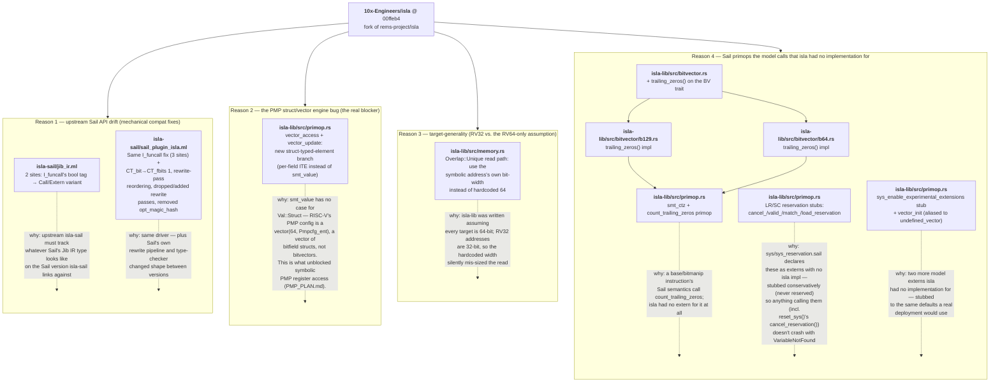

# isla fork — what changed and why

Every source-level change in the `10x-Engineers/isla` fork (commit `00ffeb4`, vs. upstream
`rems-project/isla`) that was needed to make `isla-testgen` work against the RISC-V Golden
Model. Seven files, four independent reasons. This is the file-level companion to
[`pipeline-flow.md`](pipeline-flow.md) (which shows the *runtime* flow through `isla-lib`);
this diagram shows the *fork's diff*, grouped by why each file needed to change.

## Flowchart

## Reading the grouping

| Reason | Files | Nature | Proposal relevance |
|---|---|---|---|
| 1. Sail API drift | `jib_ir.ml`, `sail_plugin_isla.ml` | Mechanical — adapts to type/API changes in the Sail version isla-sail compiles against. No new capability. | Evidence of the Rust/Isla stack's maintenance cost (criterion #2) — this is the "drift" the `EXECUTION_PLAN.md` cites as a reason not to make ISLA the backbone. |
| 2. PMP struct/vector fix | `primop.rs` (`vector_access`, `vector_update`) | A genuine engine gap closed — isla couldn't symbolically index a vector of structs at all before this. | The single most significant fix in the set — directly unblocks the **PMP** row of the coverage-risk matrix (`🟠 partial → readable`). |
| 3. Target generality | `memory.rs` | A latent RV64-only assumption, exposed by adding an RV32 target. | Necessary for any RV32 config; not RISC-V-specific once fixed — benefits all future 32-bit targets. |
| 4. Missing primops | `bitvector.rs`, `b129.rs`, `b64.rs`, `primop.rs` (4 stubs + 1 real feature) | Model calls externs isla never implemented — some given real semantics (`count_trailing_zeros`), some conservatively stubbed (atomics reservation, experimental-extensions gate). | The atomics stubs are exactly why the coverage-risk matrix marks **Atomics** as "moderate (reservation stubbed)" rather than proven — real LR/SC semantics still need implementing, not just unblocking. |

**Net read:** of 7 changed files, only 1 (`primop.rs`'s struct-vector branch) is a hard engine
capability that was missing; the rest is either mechanical version-tracking (Reason 1),
a latent bug incidentally exposed by RV32 (Reason 3), or externs stubbed just enough to not
crash (Reason 4). That matches the plan's framing: ISLA is workable as a specialist, but each
new instruction class risks hitting another one of these — which is the argument for probing
canaries early (`comparison/coverage-risk-matrix.md`) rather than assuming the stack is now
fully general.
