# isla-gen RISC-V pipeline — flow diagram

How `isla-testgen` turns a single RISC-V opcode into a verified, self-checking test, using the
Sail RISC-V Golden Model as the semantics. This is the pipeline the `addi` and PMP tests already
run through end-to-end; Phase 3 extends it class by class.

> Reading guide for the source: the RISC-V-specific code is in three files of the `isla-testgen`
> fork (`riscv-enablement` branch) — `src/target.rs` (the `RiscV` `Target` impl), `src/execution.rs`
> (the generic driver, with a few RISC-V-shaped fixes), and `src/generate_object_riscv.rs` (ELF
> emitter). The symbolic engine + SMT live in the `isla` submodule (`isla-lib`). The model-side
> additions live in the `sail-riscv` fork. See the per-node annotations below.

## End-to-end flow

```mermaid
flowchart TD
    CLI["<b>CLI</b> — isla-testgen -a riscv32 -A riscv32.ir -C riscv32.toml 0x00100093<br/><i>testgen.rs: -a dispatch → testgen_main(RiscV {})</i>"]
    LOAD["<b>Load</b> compiled IR (riscv32.ir) + config (riscv32.toml)"]

    subgraph INIT["Initialise (execution.rs + Golden Model)"]
      INITF["<b>init_function</b> = isla_testgen_init<br/><i>target.rs</i> → model reset()<br/><i>main.sail: concrete boot — PC=0x8000_0000, reset_pmp()</i>"]
      REGS["<b>setup_init_regs</b><br/>symbolic x1..x31; PC overwritten with concrete init_pc<br/><i>execution.rs (PC double-init fix)</i>"]
    end

    OPC["<b>setup_opcode</b> — place opcode in memory at PC<br/>PC zero-extended to addr_size=64 for the mem read<br/><i>execution.rs (addr_size fix)</i>"]

    subgraph STEP["Symbolic execution (per instruction)"]
      RUNF["<b>run_instruction_function</b> = isla_testgen_step<br/><i>target.rs</i> → model fetch/decode/execute<br/><i>main.sail: fetch() + execute() + nextPC/tick_pc</i>"]
      ILIB["<b>isla-lib</b> interprets the Jib IR symbolically<br/>primops, vector_access, smt_value<br/><i>isla submodule (isla-lib)</i>"]
      SMT["<b>Z3</b> solves the path constraints<br/>→ concrete reg/mem values satisfying the semantics"]
    end

    EXTRACT["<b>extract_state</b> — pre-state & post-state (regs + memory)<br/><i>extract_state.rs</i>"]
    FINAL["<b>finalize</b> — pick scratch regs (first_gpr_index=1..31),<br/>place exit trampoline jalr x0,0(exit_reg)<br/><i>execution.rs (first_gpr_index fix) + target.rs final_instruction</i>"]

    TESTFILE["<b>--test-file</b> — text trace<br/><i>generate_testfile.rs</i>"]
    ELF["<b>ELF</b> — preamble loads init GPRs, jumps to test,<br/>finish checks final state, tohost pass/fail<br/><i>generate_object_riscv.rs: make_asm_files → build_elf_file</i>"]
    VERIFY["<b>Verify</b> — sail_riscv_sim --rv32  and  spike --isa=rv32imac<br/>exit 0 = pass"]

    CLI --> LOAD --> INITF --> REGS --> OPC --> RUNF --> ILIB --> SMT --> EXTRACT --> FINAL
    FINAL --> TESTFILE
    FINAL --> ELF --> VERIFY

    classDef model fill:#123236,stroke:#35b5c0,color:#eef;
    classDef ilib fill:#33291a,stroke:#e0a24a,color:#eef;
    class INITF,RUNF model;
    class ILIB,SMT ilib;
```

**Teal nodes** = calls into the Sail Golden Model (`sail-riscv` fork).
**Amber nodes** = the `isla` symbolic engine + Z3 (`isla-lib`).

## Where each RFP-relevant capability lives

| Capability | Where |
|---|---|
| **Sail** (the semantics) | The compiled `riscv32.ir`, produced by `isla-sail` from the `sail-riscv` fork. Entry points `isla_testgen_init`/`isla_testgen_step` in `main.sail`. |
| **ISLA is called** | `execution.rs::run_instruction` invokes `run_instruction_function` (`isla_testgen_step`); isla-lib drives the symbolic interpretation of the Jib IR. |
| **SMT solving** | isla-lib → Z3, over the path constraints produced during the symbolic step. |
| **Instruction generation** | Currently the opcode is hand-supplied on the CLI; Phase 3 / the framework generalise this. |
| **ELF generation** | `generate_object_riscv.rs` — `make_asm_files` (assembly + self-check harness) → `build_elf_file` (toolchain assemble + link). |

## The two model-side pieces that made privileged access work

- **CSR/PMP dispatch** — `read_CSR`/`write_CSR`/`is_CSR_accessible`/`is_CSR_exception_virtual`
  were de-scattered so a concrete CSR address resolves to one `match` arm, avoiding a symbolic
  index into `pmpcfg_n` (which hit an isla-lib `smt_value`-on-struct gap). See `PMP_PLAN.md`.
- **`reset_pmp()`** now builds a fully concrete `Mk_Pmpcfg_ent(zeros())` per entry.

This is the boundary Phase 3 maps class by class in the
[coverage-risk matrix](../../comparison/coverage-risk-matrix.md): where isla-lib blocks
(PMP struct/vector, VM/PTW path explosion), the oracle backbone covers by construction — the
core argument for the hybrid.
