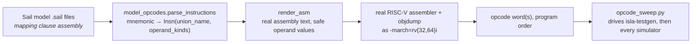

# Model-sourced opcode generation — `model_opcodes.py` + `opcode_sweep.py`

How the framework decides **which instructions to test** and **what encodes them**, and how a
single generated test is run across all four available targets (Sail, Spike, QEMU, CVA6 RTL).
This is the companion doc to [`isla-gen/pipeline-flow.md`](../isla-gen/pipeline-flow.md) (which
covers what happens *after* an opcode is handed to `isla-testgen`); this doc covers everything
upstream and downstream of that: sourcing the opcode from the model, and running the resulting
ELF everywhere.

## Why model-sourced, not `riscv-opcodes`

Earlier work (see [`rv_i-opcode-sweep-findings.md`](../isla-gen/rv_i-opcode-sweep-findings.md))
drove the sweep from `riscv-opcodes`, the community-maintained opcode table. That answers "what
does RISC-V define" — not "what does *this* Sail model implement." A model under active
development can lag or diverge from `riscv-opcodes` in either direction (an extension not yet
wired up, a local variant), and the RFP's own framing is explicit that the goal is testing the
Golden Model, not the ISA spec in the abstract.

`model_opcodes.py` instead parses the model's own `mapping clause assembly` blocks — the
bidirectional Sail definitions the model itself uses to print and parse assembly text. If a
mnemonic isn't defined there, the model doesn't implement it, and the sweep never generates a
test for it. This is a hard guarantee, not a best-effort filter: the instruction list *is* the
parsed output of the model's source, so there's no way for it to drift from what the model
actually does.

Two deliberately separate jobs:

1. **Which instructions exist, and what operands they take** — parsed straight from
   `mapping clause assembly` (mnemonic templates, operand kinds: register / immediate /
   `imm(reg)` memory operand).
2. **What bits encode a given instance** — rendered as real assembly text and handed to the real
   RISC-V assembler (`as -march=rv{32,64}i`), then read back via `objdump`. This mirrors the
   principle `autotest/src/sailtest/model.py` already established for the oracle backend: *the
   real assembler is the encoding source of truth*, not a hand-maintained bit-layout table. It
   also sidesteps parsing Sail's separate `mapping clause encdec` blocks — a much hairier
   bidirectional bit-layout DSL with guards and sub-mappings — just to answer "what bits does
   this instruction have."



## Choosing safe operand values

`render_asm` picks register/immediate/memory values the same way the earlier hand-written sweep
did, generalized across every parsed instruction (see `model_opcodes.py`'s docstrings for the
full reasoning):

- every register operand is a distinct nonzero `x1`..`x31` — `x0` is hardwired zero, so a
  register operand must be real to have any observable effect;
- branch/jump targets (`BTYPE`, `JAL` union clauses) get a real local-label distance
  (`.Ltarget`), not a literal `0` — a literal `0` either gets rejected outright or, worse, is
  *satisfiable* as a self-loop, which would hang forever if actually run;
- load/store memory operands (`LOAD`, `STORE` union clauses) get their base register preloaded
  via `lui` to a fixed, declared-safe data address (`SAFE_DATA_ADDR = 0x80020000`, which must
  match `opcode_sweep.py`'s `--memory-region`) instead of being left fully symbolic — a fully
  free address register is architecturally free to resolve into the model's MMIO region, where
  writes aren't modeled the same way ordinary RAM writes are (this exact trap is documented in
  [`rv_i-opcode-sweep-findings.md`](../isla-gen/rv_i-opcode-sweep-findings.md), problem 3a).

### RV64 wrinkles found while extending past RV32

Two real bugs, both in *our own* generator, found by extending this pipeline from RV32-only to
RV32+RV64:

- **`lui` sign-extension.** `lui`'s result is sign-extended to XLEN. `SAFE_DATA_ADDR`
  (`0x80020000`) has bit 31 set, so on RV64 the same `lui` that correctly loads
  `0x80020000` on RV32 instead produces `0xffffffff80020000` — outside the declared
  `--memory-region` entirely. Fixed by clearing the sign-extended upper bits back to zero
  (`slli`/`srli` by 32) whenever `xlen == 64`; a no-op, correctly skipped, on RV32.
- **Fixed nonzero memory offset misaligning wide accesses.** The memory operand used to render
  as a fixed `+4(base)`. `+4` is safely aligned for `lw`/`sw` (4-byte) but not for RV64's
  `ld`/`sd` (8-byte), which sent execution down the model's misaligned-access-splitting path
  (`sys/split_access_utils.sail`'s `split_misaligned`). That path computes
  `count_trailing_zeros` on the *symbolic* base address, and the resulting non-concrete length
  then flows into isla-lib's `zeros()` primop, which cannot accept a symbolic length —
  `"Symbolic (bit)vector length in zeros"`. Root-caused (not just narrowed) via isla-testgen's
  `--all-events` flag, which dumps the full SMT event trace annotated with Sail source
  file:line — far more direct than trying to recover a call stack from inside isla-lib itself.
  Fixed by rendering the offset as `0`, not `4`: `SAFE_DATA_ADDR` is far more than 8-byte
  aligned, so `base+0` stays naturally aligned for every access width up through RV64's 8-byte
  `ld`/`sd`. See the inline comment in `model_opcodes.py::render_asm` for the full trace.

## `opcode_sweep.py` — driving generation and every simulator

`opcode_sweep.py` ties it together: parse the given `.sail` files → for each instruction, render
+ assemble → invoke `isla-testgen` → run the resulting ELF on every available simulator → report
a pass/fail/not-installed matrix.

```
python3 opcode_sweep.py extensions/I/base_insts.sail --xlen 32
python3 opcode_sweep.py extensions/I/base_insts.sail --xlen 64
```

Positional arguments are `.sail` files relative to `<sail-riscv>/model/`; pass several to sweep
more than one file in one run. `--sail-riscv` overrides the model checkout path,
`--out-dir` where generated `.elf`/`.s`/`.ld` files land (default `/tmp/opcode-sweep`).

Per instruction, the sweep reports one line:

```
PASS  addi           0x00400093              gen=ok sail= ok  spike= ok  qemu= ok
```

`gen` is whether `isla-testgen` itself reported successful generation; `sail`/`spike`/`qemu` are
each simulator's actual execution result (`ok` / `FAIL` / `--` for "not installed" — a missing
simulator never counts as a failure, only a real bad run does). A summary line at the end gives
total pass/fail/not-installed counts per simulator.

### The two mutually exclusive generation modes

There are two different physical ELF layouts the generator can produce, selected per run, not
combinable in one generated test:

- **Default** (or `--signature` for the ACT4-compatible variant — see
  [`act4/act4-integration-status.md`](../act4/act4-integration-status.md)) — the harness
  preamble runs first, in whatever region `isla-testgen`/the linker script places it; test bytes
  follow. This is what Sail, Spike, and ACT4's own build pipeline all expect: they honor the
  ELF's `ENTRY()` properly.
- **`--boot-fixed-entry`** — QEMU's `spike` machine and CVA6's bootrom both always jump to a
  fixed physical address (`0x80000000`) after reset, *ignoring* the ELF's actual entry point.
  Confirmed for QEMU via `-d in_asm` boot-trace, for CVA6 via `ariane_testharness.sv`'s
  `boot_addr_i` wiring to a fixed ROM base. This mode places the harness preamble itself at
  `0x80000000` (via `isla-testgen`'s own `--harness-code`/`--code-region` flags) and moves the
  test bytes to an explicit code region clear of the harness and the `tohost`/data regions.

The two modes disagree about what belongs at `0x80000000` — ACT4's fixed linker script wants
test bytes there, `--boot-fixed-entry` needs the preamble there — so a given generated ELF is
built for one downstream consumer or the other, not both simultaneously. In practice this means:
Sail and Spike accept output from *either* mode (they don't care what's at the boot address, they
honor `ENTRY()`); QEMU and CVA6 need `--boot-fixed-entry`; ACT4's own build needs `--signature`.

### Simulator invocations, and how pass/fail is read back

All four targets share the same signal: the model's HTIF `tohost`/`fromhost` protocol
(`generate_object_riscv.rs` writes `1` for pass, `3` for fail — byte-for-byte the same convention
as ACT4's own `RVMODEL_HALT_PASS`/`RVMODEL_HALT_FAIL`). Each simulator surfaces that as a process
exit code:

| Simulator | Invocation | Notes |
|---|---|---|
| Sail | `sail_riscv_sim [--rv32] <elf>` | RV64 is the binary's default config — there is no `--rv64` flag, confirmed via `--help`. |
| Spike | `spike --isa=rv{32,64}imac <elf>` | Bare-metal, no proxy kernel; exit code is Spike's own HTIF-derived status. |
| QEMU | `qemu-system-riscv{32,64} -machine spike -nographic -bios none -kernel <elf>` | `-machine spike`, not `virt` — `spike` is QEMU's board model that emulates HTIF, matching `autotest/src/sailtest/runner.py`'s own convention. Requires `--boot-fixed-entry`. |
| CVA6 (RTL) | `./work-ver/Variane_testharness <elf>` | Verilator-built testbench; pass/fail read from `dtm->exit_code()`. Requires `--boot-fixed-entry`. See build notes below. |

CVA6 isn't wired into `opcode_sweep.py` itself (it needs a Verilator build step, not just a
binary on `PATH`), but every ELF the sweep produces in `--boot-fixed-entry` mode is the exact
same file format that was hand-verified against the built CVA6 testbench — same generation
pipeline, same HTIF convention.

## Building the CVA6 (RTL) target

Not required for Sail/Spike/QEMU. To also verify against RTL:

```
cd /home/jk/Documents/openhw/cva6
make NUM_JOBS=8 CFG_CXXFLAGS_STD="-std=gnu++17" verilate
./work-ver/Variane_testharness <elf-built-with---boot-fixed-entry>
```

The `CFG_CXXFLAGS_STD` override and a handful of testbench-source fixes were needed to bridge a
version gap between CVA6's pinned ~2023-era C++ testbench (`corev_apu/tb/ariane_tb.cpp`) and a
current Verilator 5.027 install — `--no-timing` on the verilate command, an explicit
`fesvr::load_elf()` 4-argument call, a `_testharness___024root.h` include for internal-signal
access, and routing SRAM preload through `top->rootp->...[0]` instead of `.data()` (the latter is
a genuine bug in this Verilator version's `VlUnpacked<T,N>::data()`, which returns the wrong
pointer width for a non-32-bit element type). None of these are RISC-V- or Sail-specific; they're
purely CVA6/Verilator version-skew fixes, kept local to the CVA6 checkout.

## Status

Both RV32 and RV64 verified end-to-end on `add` (and the full `rv_i` set on RV32, per
[`rv_i-opcode-sweep-findings.md`](../isla-gen/rv_i-opcode-sweep-findings.md)) across all four
targets: Sail, Spike, QEMU, and CVA6 RTL each independently confirm pass on a
`--boot-fixed-entry`-generated ELF; Sail and Spike additionally confirm pass on the default and
`--signature` (ACT4) layouts.

Every privileged instruction the model implements (Zicsr, Svinval, and the base ISA's `mret`/
`sret`/`wfi`/`ecall`/`ebreak`/`sfence.vma`) has since been swept the same way, extension by
extension, with Sail specification-coverage measured on the result — see
[`privileged-instruction-coverage.md`](privileged-instruction-coverage.md).
